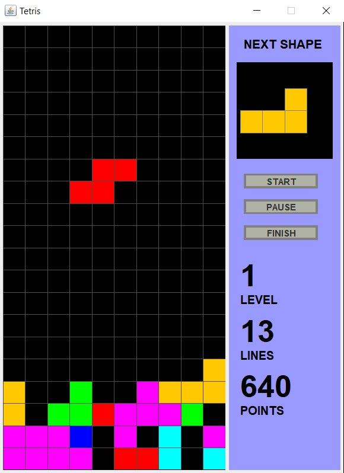

# Tetris

My impelmentation of the popular Tetris game in Java Swing.

### How to play?
 * **Left arrow**- moves a tetromino to the right
 * **Right arrow**- moves a tetromino to the left
 * **Down arrow**- makes tetromino fall faster
 * **Up arrow**- rotates the tetromino 
 
### General rules
1. The game is over if tetromino reach the top of the screen.
2. Level increases with every 10 lines removed.
3. Tetromino falls faster with every level up.

### Scoring system
| Level  | 1 line| 2 lines|3 lines|4 lines|
| ------ |:------:| :------:|:------:|:------:|
| 0      |  40   | 100    | 300   | 1200  | 
| 1      |  80   |   200  | 600   | 2400  |
| 2      |  120  |    300 | 900   | 3600  |
| n      |40*(n+1)|100*(n+1)|300*(n+1)|1200*(n+1)|
